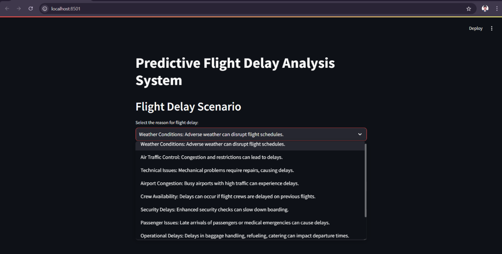
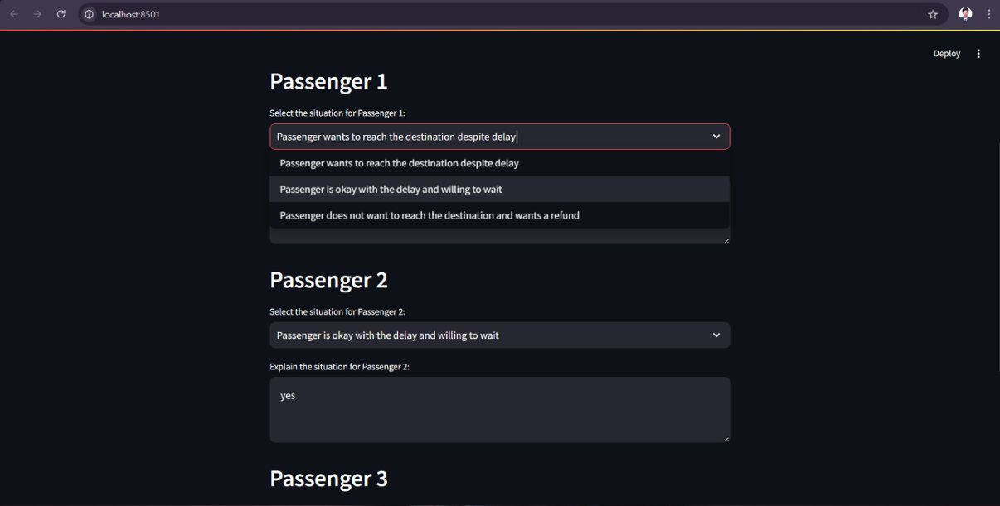
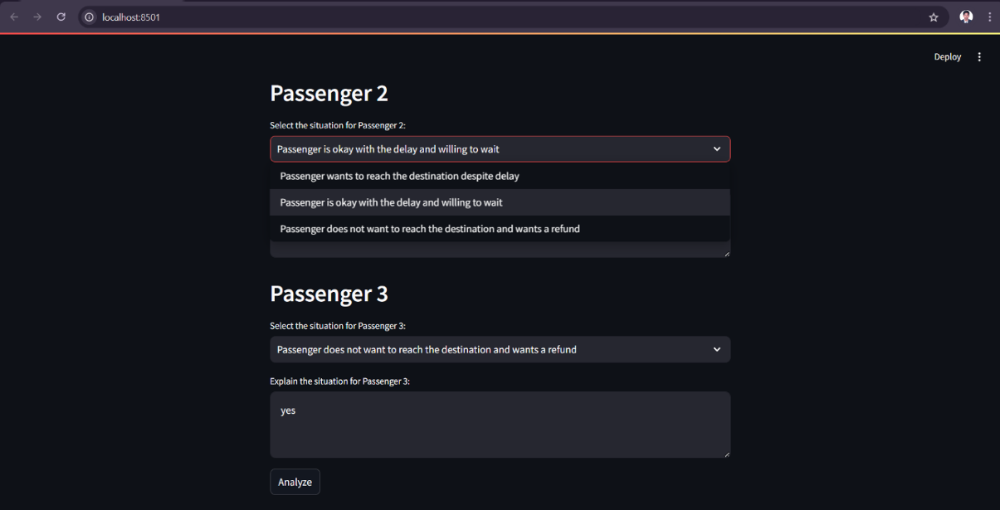
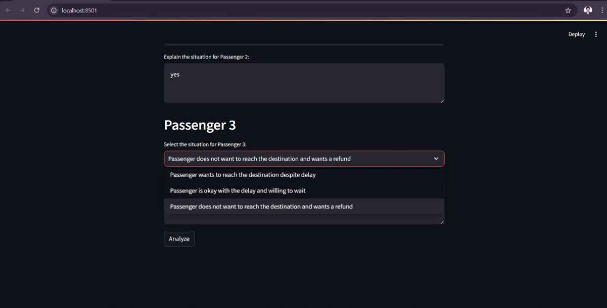
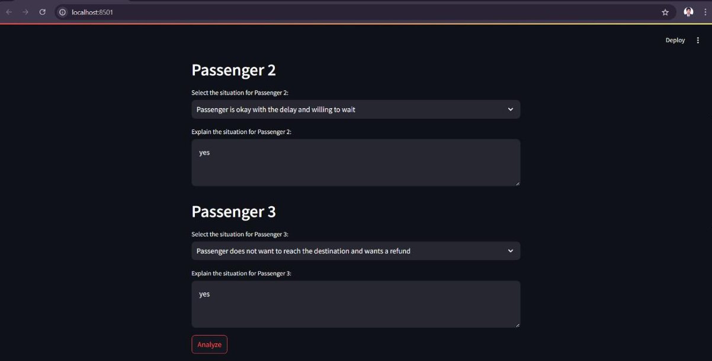

# Flight Delay Analysis 
*Plan your journey smarter with the Flight Delay Analysis system!
This intelligent application predicts the chances of flight delays and provides useful recommendations to help passengers make better travel decisions.
Whether it’s a short domestic trip or a long international flight, this tool helps you travel with confidence.*

---

## 📘 About the Project

->  *Flight Delay Analysis is a machine learning–based program that analyzes historical flight data to identify patterns and predict possible delays.* 

->  *It considers multiple factors such as airline, weather, route, and time of departure.*

->  *The system also uses LLaMA 3.1 (via Ollama) to generate personalized suggestions, helping passengers avoid delays and plan their trips more effectively.*

  
---
## ⚙ Features
- ✅ Data ingestion & cleaning for flight and weather datasets.  
- ✅ Exploratory visualizations: histograms, heatmaps, time-series, route comparisons.  
- ✅ Statistical analysis: correlation, hypothesis testing, and trend decomposition.  
- ✅ Clustering and segmentation of routes/carriers to identify problem groups.  
- ✅ Interactive dashboard for filtering and visual inspection (Streamlit / Dash).  
- ✅ Exportable visual reports (PNG/PDF) for meetings and presentations.

---

---

## 💻 Tech Stack
| Component | Technology |
|-----------|------------|
| *Data Processing* | Python, Pandas, NumPy |
| *Visualization* | Matplotlib, Seaborn, Plotly |
| *Dashboard* | Streamlit or Dash |
| *Storage* | CSV / SQLite / PostgreSQL |
| *Reporting* | Jupyter Notebooks, PDF/PNG exports |

---

## 🧩 Modules
1. **Data Ingestion & Cleaning**
   - Load raw flight records, join with weather and airport metadata, normalize timestamps, and handle missing values.

2. **Exploratory Data Analysis (EDA)**
   - Delay distributions, top delay causes, carrier/airport performance, hourly/daily/weekly seasonality.

3. **Statistical Analysis**
   - Correlation matrices, t-tests/ANOVA for group differences, and time-series decomposition for trend/seasonality.

4. **Segmentation & Clustering**
   - Cluster routes/carriers by delay characteristics to detect systemic issues.

5. **Visualization & Dashboarding**
   - Interactive tools and static figures for stakeholders: heatmaps, time-series, route maps, and comparative bar charts.

6. **Reporting**
   - Generate summary reports and export figures for presentations.

---

## 🖼 Output

### 🗂️ Scenario Selection 


### 👤 Type Selection 


### 👥 Passenger 2 Type Selection


### 👨‍👩‍👧 Passenger 3 Type Selection 


### ▶️ Analyze  


### 🧾 Solution


---

## 🚀 Requirements

- **Python** 3.11+  
- **Streamlit**  
- **scikit-learn**  
- **pandas**, **numpy**  
- **Ollama** (for LLaMA 3.1 model)  
- **matplotlib**, **seaborn**

---

## ⚙️ Setup & Installation

### 1. Clone the Repository
    
    ``` bash 
    
     git clone https://github.com/<your-username>/flight-delay-analysis.git
               cd flight-delay-analysis
  
### 2️. 📦 Install Required Packages

  pip install -r requirements.txt

### 3️. 🧠 Pull the LLaMA Model (Ollama)

  ollama pull llama3.1

### 4️.▶️ Run the Streamlit Application

  python -m streamlit run fligh.py
 

